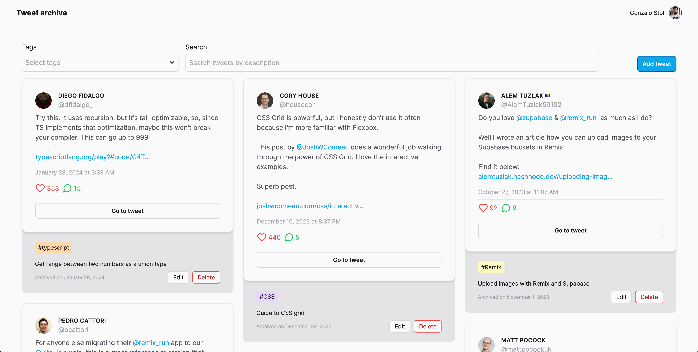
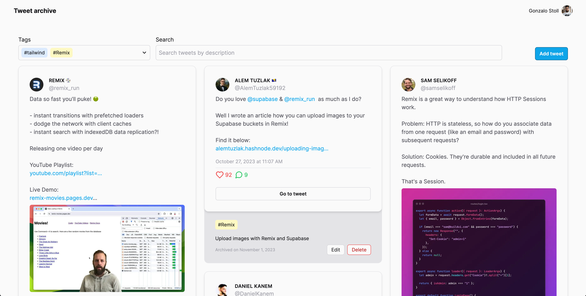
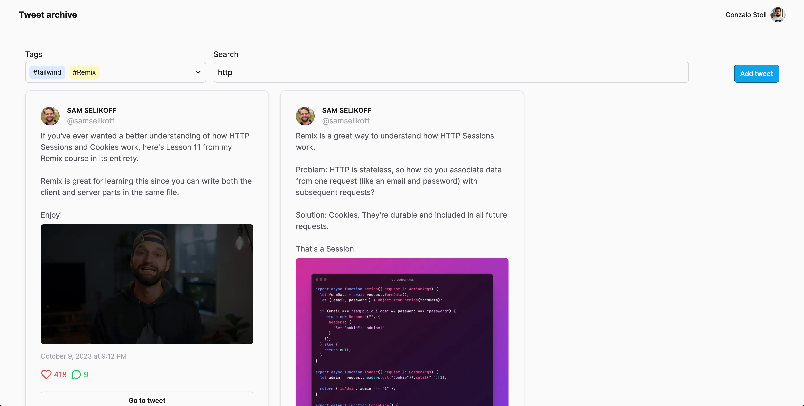

# Tweet Archive

Do you ever find yourself in Twitter (excuse me, X) scrolling through your bookmarks/retweets/likes and not being able
to find the tweet you're looking for?

Then this app is for you :)

Tweet Archive is an app where you can store relevant tweets for later reference. You can tag them, search through them
and edit them at any point in time, at your leisure.

## Features

- Add tweets to your archive
- Tag tweets
- Search through your archive
- Edit tweets
- Delete tweets

## Tech Stack and infrastructure

- Next.js
- Tailwind CSS
- Drizzle
- Zod
- Planetscale
- Vercel
- Clerk

## How to run the app
