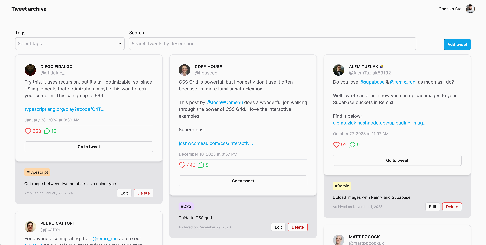
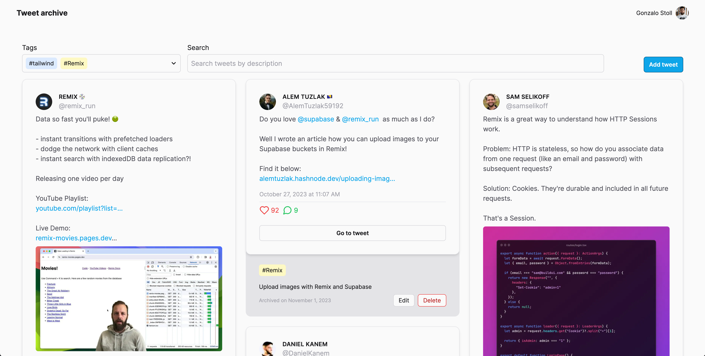
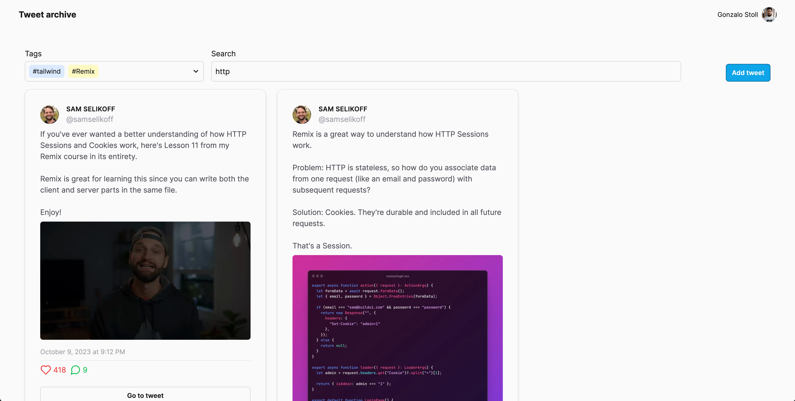

# Tweet Archive

Tweet Archive is an app where you can store relevant tweets for later reference.
You can tag them, search through them and edit them at any point in time, at
your leisure.





## Features

- Add tweets to your archive
- Tag tweets
- Search through your archive
- Edit tweets
- Delete tweets

## Tech Stack and infrastructure

- Remix
- Tailwind CSS
- Drizzle ORM
- Zod
- Bun
- Vercel
- Turso
- Clerk
- Upstash

## How to run the app

This project uses Turso for the database (so... SQLite), Clerk for
authentication and Upstash for ratelimiting. So, you will need to create an
account on these platforms and set up the necessary environment variables. You
can find the necessary environment variables in the `.env.example` file. Copy
the contents of the file to a new file called `.env.local` and fill in the
necessary values. The app will not work at all without them.

Once you have the environment variables set up, you need to install its
dependencies:

```bash
bun install
```

Next thing, you'll need to run the db migrations and push the schema to
Turso:

```bash
bun db:generate && bun db:migrate && bun db:push
```

If you want to have some data right off the bat, it's going to be extremely
simple thanks to SQLite's simplicity. You need to first generate a local
database file by running:

```bash
turso dev --db-file local.db
```

This will create a `local.db` file in the root of the project. You can now
populate it with some data:

```bash
bun db:seed
```

Now you can run the app:

```bash
bun dev
```
